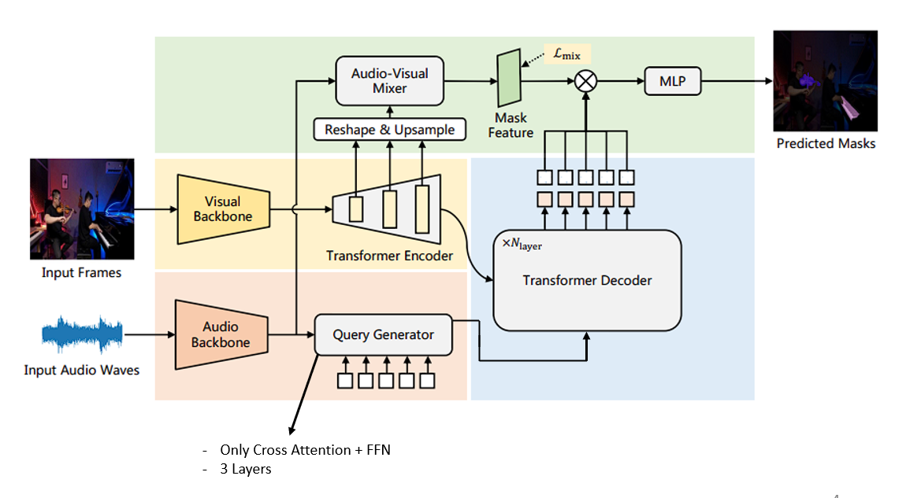

# Less is More: Simplifying Query Generation for Audio-Visual Segmentation



## Updates
- (2025.12.20) document(README, ...) creation complete!
- (2025.12.17) We completed the implemention of AVSegFormer(our improved version).


## How To Start?

### 1. Requirements and Installation
## a. Want to Use Docker
```shell
# project clone
git clone https://github.com/seongsoo-jeon/avsegformer.git
cd avsegformer

# build image
docker build -t avsegformer . 

# run container (connect to container by cli && ./data to /app/AVSegFormer/data)
docker run --gpus all \
    -v "$(pwd)/data:/app/AVSegFormer/data" --shm-size=16g \
    -it avsegformer bash

# if window (powershell)
# docker run --gpus all -v "${PWD}/data:/app/AVSegFormer/data" --shm-size=16g -it avsegformer bash
```

## b. Local Environments
```shell
# project clone
git clone https://github.com/seongsoo-jeon/avsegformer.git
cd avsegformer

# recommended
pip install torch==1.10.0+cu111 torchvision==0.11.0+cu111 torchaudio==0.10.0 -f https://download.pytorch.org/whl/torch_stable.html
pip install mmcv-full -f https://download.openmmlab.com/mmcv/dist/cu111/torch1.10.0/index.html
pip install pandas timm resampy soundfile

# build MSDeformAttention
cd ops
sh make.sh
```


### 2. Data Preparation
Please refer to the link [AVSBenchmark](https://github.com/OpenNLPLab/AVSBench) to download the datasets. You can put the data under `data` folder. Remember to modify the path in config files. The `data` directory is as bellow:
```
|--data
   |--Multi-sources
      |--ms3_meta
      |--ms3_meta_data.csv
   |--Single-source
      |--s4_data
      |--s4_meta_data.csv
   |--AVSS
```


### 3. Download Pre-Trained Models

- The pretrained backbone is available from benchmark [AVSBench pretrained backbones](https://drive.google.com/drive/folders/1386rcFHJ1QEQQMF6bV1rXJTzy8v26RTV).
- We use AVSegFormer's pre-trained models for all three subtasks. You can download them from [AVSegFormer pretrained models](https://drive.google.com/drive/folders/1ZYZOWAfoXcGPDsocswEN7ZYvcAn4H8kY).

|Method|Backbone|Subset|Lr schd|Config|mIoU|F-score|Download|
|:---:|:---:|:---:|:---:|:---:|:---:|:---:|:---:|
|AVSegFormer-R50|ResNet-50|S4|30ep|[config](config/s4/AVSegFormer_res50_s4.py)|76.42|87.1|[ckpt](https://1drv.ms/u/c/2fe081366d17e11a/IQD8BC_2tbcGTrJt0k6OjsceASsEyHsPWJd3zp_hs1lItIs?e=Q52Xw8)|
|AVSegFormer-PVTv2|PVTv2-B5|S4|30ep|[config](config/s4/AVSegFormer_pvt2_s4.py)|83.72|91.1|[ckpt](https://1drv.ms/u/c/2fe081366d17e11a/IQDB1r0x7-uOTakligfHjRiHAXK_NCEYISqmQnuEg4qIw7E)|
|AVSegFormer-R50|ResNet-50|MS3|60ep|[config](config/ms3/AVSegFormer_res50_ms3.py)|56.17|68.5|[ckpt](https://1drv.ms/u/c/2fe081366d17e11a/IQAP-12XnYWMRYJK8k66DoqpAd8GSRQPdRHNoVB8ARUAtiQ?e=3U79G8)|
|AVSegFormer-PVTv2|PVTv2-B5|MS3|60ep|[config](config/ms3/AVSegFormer_pvt2_ms3.py)|63.09|73.8|[ckpt](https://1drv.ms/u/c/2fe081366d17e11a/IQCa5YMct54YQKpr6ZUteFk2Ab9ndNnYrG2MX4i-0EyFafo?e=KXkOUp)|


### 4. Train
```shell
TASK = "s4"  # or ms3, avss
CONFIG = "config/s4/AVSegFormer_pvt2_s4.py"

bash train.sh ${TASK} ${CONFIG}
```


### 5. Test
```shell
TASK = "s4"  # or ms3, avss
CONFIG = "config/s4/AVSegFormer_pvt2_s4.py"
CHECKPOINT = "work_dir/s4/S4_pvt.pth"

bash test.sh ${TASK} ${CONFIG} ${CHECKPOINT}
```


## Citation

If you use our model, please consider cite following papers:
```
@article{zhou2023avss,
      title={Audio-Visual Segmentation with Semantics}, 
      author={Zhou, Jinxing and Shen, Xuyang and Wang, Jianyuan and Zhang, Jiayi and Sun, Weixuan and Zhang, Jing and Birchfield, Stan and Guo, Dan and Kong, Lingpeng and Wang, Meng and Zhong, Yiran},
      journal={arXiv preprint arXiv:2301.13190},
      year={2023},
}

@misc{gao2023avsegformeraudiovisualsegmentationtransformer,
      title={AVSegFormer: Audio-Visual Segmentation with Transformer}, 
      author={Shengyi Gao and Zhe Chen and Guo Chen and Wenhai Wang and Tong Lu},
      year={2023},
      eprint={2307.01146},
      archivePrefix={arXiv},
      primaryClass={cs.CV},
}

@misc{ours2025code,
      title={Less is More: Simplifying Query Generation for Audio-Visual Segmentation}, 
      author={SeongSoo Jeon, Yunjae Yu},
      year={2025},
      publisher={GitHub},
      journal={GitHub repository},  
      howpublished={\url{https://github.com/seongsoo-jeon/avsegformer.git}},
}
```

